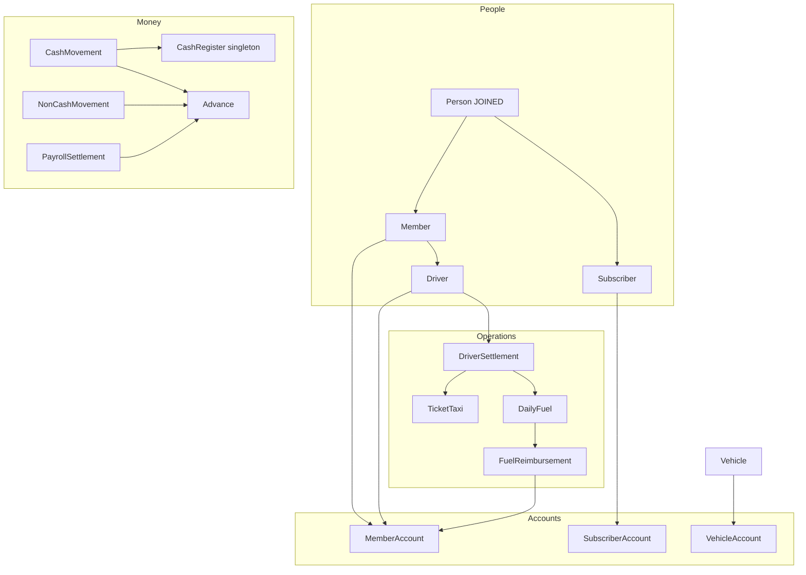

<h1 align="center">Cooperative Taxi Management</h1>

<p align="center">
  Backend for the administrative and accounting operations of an Argentine taxi cooperative.
</p>

<p align="center">
  
  
  
  
  
</p>

> **Archived.** This project is **no longer under development**. It is kept as a portfolio piece: a domain-rich Spring Boot API that models a real cooperative’s day-to-day accounting, instead of a generic CRUD demo.

---

## The problem

The author worked in the accounting office of a taxi cooperative. Daily work lived in **Excel files split across folders**, with rules that only made sense if you already knew them: driver settlements (*rendiciones*), fuel tickets, salary advances (*vales*), payroll, physical receipt booklets (*talonarios*), vehicle workshop charges, and member/subscriber accounts that can go into debt.

That workflow is slow, easy to break, and almost impossible to hand over to someone new. This API was started to put those rules in one place: a layered backend with a relational model that matches how the cooperative actually operates.

---

## What it is

A **backend-only** REST API (Spring Boot + JPA + MySQL) for:

- **People** — members (several roles), drivers, and monthly subscribers (*abonados*)
- **Fleet** — brands, models, vehicles (plate, engine, chassis, VTV expiry)
- **Current accounts** — one account per member, subscriber, and vehicle (balances may be negative)
- **Driver settlements** — taxi tickets + daily fuel attached to a rendición
- **Fuel reimbursement** — GNC/nafta split (typically 50/50), credit accumulated off-balance, then paid into the member account
- **Cash desk** — singleton cash register, daily open/close history, cash vs non-cash movements
- **Payroll** — salary advances and monthly liquidations
- **Paper receipts** — booklet + receipt number, unique per period and account
- **Monthly account history** — closing balances generated on a schedule

There is **no frontend** in this repository. An Angular UI was planned and never started. Authentication (JWT) was also planned; the Security starter is on the classpath but **autoconfiguration is disabled** in the example config, so the API runs open for local exploration.

---

## Highlights

- **Real cooperative domain**, not a tutorial schema: rendiciones, vales, liquidaciones, talonarios, GNC vs nafta, workshop vs lubrication-center charges.
- **Layered architecture:** Controller → Service → Validator → Repository → Entity, with DTOs nested by domain (`person/member/driver`, `vehicle/account`, …).
- **JPA inheritance used on purpose:** `JOINED` for people, money movements, and the unfinished account-movement tree; `@MappedSuperclass` for the three account types.
- **Automatic side effects** that match office practice:
  - creating a member, driver, subscriber, or vehicle also creates its account at balance `0`
  - an `ADVANCE` money movement creates an `Advance` and **does not** change the member balance
  - paying a payroll settlement creates a non-cash `PAYMENT` movement
  - daily fuel credit accumulates into `FuelReimbursement` and is later reimbursed into the account
- **Soft delete** on accounts, movements, receipts, payroll, vehicles, and fuel credit; members/drivers leave with a `leaveDate`.
- **Cash vs ledger separated:** cash movements hit both the account and the physical cash register; non-cash movements hit only the account. Direction comes from `isIncome`, not from `MovementType`.
- **Scheduled monthly snapshots** of every active account (`@EnableScheduling`, cron on the 1st at 00:00), plus a manual trigger for testing.
- **OpenAPI / Swagger UI** documenting the implemented endpoints (descriptions in Spanish).
- Last incomplete slice still visible in the code: **Account Movements** (income/expense types, monthly charges, workshop repairs, settlement allocations) have entities, DTOs, repositories, and validators — **no services or controllers**.

---

## Architecture

```
                         ┌──────────────────────────┐
  Swagger UI ──────────► │  Spring Boot REST API    │
  (no SPA in this repo)  │  localhost:8080          │
                         │  Controllers / Services  │
                         │  Validators / JPA        │
                         └────────────┬─────────────┘
                                      │
                                      ▼
                         ┌──────────────────────────┐
                         │  MySQL                   │
                         │  cooperative_taxi_db     │
                         │  Hibernate ddl-auto=update
                         └──────────────────────────┘
```



---

## Tech stack

| Layer | Choice |
|-------|--------|
| Runtime | **Java 17** |
| Framework | **Spring Boot 3.5.6** |
| API | Spring Web, Bean Validation, **springdoc-openapi 2.8.8** |
| Persistence | Spring Data JPA / Hibernate (`ddl-auto=update`) |
| Database | **MySQL 8** |
| Scheduling | Spring `@Scheduled` (monthly account histories) |
| DX | Lombok, Spring Boot DevTools, Actuator (on the classpath) |
| Build | Maven (wrapper included) |
| Security | `spring-boot-starter-security` present, **autoconfig excluded** — no JWT, no login |
| Frontend | **None** |

---

## Domain modules

### People and fleet

| Module | What it models |
|--------|----------------|
| **Members** | Cooperative members with role `ADMINISTRATIVE`, `PRESIDENT`, `DRIVER_1`, `DRIVER_2`, `MECHANIQUE`, `OPERATOR`, plus address |
| **Drivers** | Members with a driving-licence expiry; they get a member account like any other member |
| **Subscribers** | Monthly customers (*abonados*) with a list of 4-digit licence numbers |
| **Brand / Model / Vehicle** | Fleet catalogue; unique plate, licence number, engine, and chassis; VTV expiration; leave date |

### Accounts

Each member, subscriber, and vehicle has a current account. Balance **may be negative** (debt). Soft-deleted via `active`.

### Driver settlements (*rendiciones*)

A driver submits a settlement with:

- **Taxi tickets** (`TicketTaxi`) — amount, optional km and trip count, start/cut dates
- **Daily fuel** (`DailyFuel`) — GNC or nafta, issue/submission dates, cooperative vs driver percentage (must sum to 100; defaults to last same fuel type or 50/50)

`finalBalance = ticketAmount − voucherAmount + voucherDifference`. Ticket totals can be recalculated from associated tickets.

Fuel credit for the driver is **not** mixed into the live account balance. It accumulates on `FuelReimbursement` and is moved onto the account only when reimbursed (typically fortnightly, by an explicit API call).

### Cash and ledger

| Piece | Behaviour |
|-------|-----------|
| `CashRegister` | Single physical till, created on startup |
| `CashRegisterHistory` | Open/close a business day |
| `CashMovement` | Updates account **and** till |
| `NonCashMovement` | Updates account only (transfers, credits, payroll payments) |

`MovementType` is a category (`DEPOSIT`, `WITHDRAWAL`, `TRANSFER`, `PAYMENT`, `REFUND`, `ADVANCE`, `WORKSHOP_ORDER`, `OTHER`). Sign is `isIncome`. Constraints: `ADVANCE` only on member accounts; `WORKSHOP_ORDER` only on vehicle accounts. Edit/delete **reverts** balances first.

### Payroll

- **Advances (*vales*)** — created from `ADVANCE` movements or manually; not allowed for `DRIVER_1` / `DRIVER_2`; do not change account balance
- **Payroll settlements** — unique per `(memberAccount, period)`; `netSalary = max(0, gross − sum of advances)`; setting `paymentDate` posts a non-cash `PAYMENT` for the gross amount

### Receipts and monthly history

Physical receipts are unique by `(account, period)` and by `(receiptNumber, bookletNumber, receiptType)` where type is `MEMBER` or `SUBSCRIBER`. The same booklet numbers may exist for both types.

On the first day of each month the scheduler writes an `AccountHistory` row (closing balance) for every active account. There is also `POST /account-histories/generate-monthly-histories` for manual runs.

### Account movements (unfinished)

Designed (see [`BOCETO_ACCOUNT_MOVEMENTS.md`](BOCETO_ACCOUNT_MOVEMENTS.md)) and partially coded:

- Income / expense **types** with optional monthly recurrence
- `AccountIncome`, `MonthlyExpense`, `WorkshopRepair` (`JOINED` inheritance)
- `SettlementAllocation` — split a charge across a receipt, a payroll settlement, or a money movement (XOR), with immutability when tied to official documents

**Missing:** services, REST controllers, and the monthly recurrence job. This is where development stopped.

---

## Data model (simplified)

```
Person (JOINED)
 ├── Member ──1:1── MemberAccount
 │     └── Driver
 └── Subscriber ──1:1── SubscriberAccount

Brand ──* Model ──* Vehicle ──1:1── VehicleAccount

Driver ──* DriverSettlement
              ├──* TicketTaxi (→ Vehicle)
              └──* DailyFuel  (→ Driver, Vehicle) ──► FuelReimbursement (1:1 MemberAccount)

AbstractMovement (JOINED)
 ├── CashMovement    → CashRegister
 └── NonCashMovement
        └── ADVANCE ──► Advance ──► PayrollSettlement

Receipt  (MemberAccount XOR SubscriberAccount)
AccountHistory  (one of the three account types)
```

---

## Implemented vs unfinished

| Area | Status |
|------|--------|
| Members, drivers, subscribers, brands, models, vehicles | REST CRUD |
| Three account types + auto-create on owner insert | REST CRUD |
| Driver settlements, taxi tickets, daily fuel, fuel reimbursement | REST CRUD |
| Cash register, cash/non-cash movements | REST CRUD |
| Advances and payroll settlements | REST CRUD |
| Receipts and monthly account history | REST CRUD + scheduler |
| Account movements (workshop, monthly fees, allocations) | Entities / validators / repos only |
| Login, JWT, roles on HTTP | Not implemented (security auto-config off) |
| Angular UI, PDF reports, Flyway | Not started |
| Automated tests | Context-load stub only |

Spanish development notes (now historical) live in [`ESTADO_PROYECTO.md`](ESTADO_PROYECTO.md).

---

## Project structure

```
Cooperative_taxi_management/
├── README.md
├── ESTADO_PROYECTO.md              Spanish status log (historical)
├── BOCETO_ACCOUNT_MOVEMENTS.md     Design for the unfinished module
├── fix_payroll_settlements.sql     Manual DDL note (column names may be stale)
└── backend/
    ├── pom.xml
    ├── mvnw / mvnw.cmd
    └── src/main/java/com/pepotec/cooperative_taxi_managment/
        ├── config/                 OpenAPI
        ├── controllers/            22 REST controllers
        ├── converters/             YearMonth ↔ column
        ├── exceptions/             Global handler + domain exceptions
        ├── models/dto|entities|enums/
        ├── repositories/
        ├── services/
        └── validators/
```

Package spelling follows the original artifact id: `cooperative_taxi_managment`.

---

## Getting started

### Prerequisites

- JDK **17**
- Maven 3.8+ (or the wrapper)
- MySQL 8

### 1. Clone

```bash
git clone https://github.com/MoralesCuevasLuciano/Cooperative_taxi_management.git
cd Cooperative_taxi_management/backend
```

### 2. Database

```sql
CREATE DATABASE cooperative_taxi_db CHARACTER SET utf8mb4 COLLATE utf8mb4_unicode_ci;
```

Hibernate creates/updates tables on startup (`spring.jpa.hibernate.ddl-auto=update`). There is no Flyway/Liquibase.

### 3. Configuration

```bash
cp src/main/resources/application.properties.example src/main/resources/application.properties
```

PowerShell:

```powershell
Copy-Item src\main\resources\application.properties.example src\main\resources\application.properties
```

Set `spring.datasource.username` and `spring.datasource.password`. `application.properties` is not committed.

### 4. Run

```bash
./mvnw spring-boot:run
```

Windows:

```bash
.\mvnw.cmd spring-boot:run
```

- API: [http://localhost:8080](http://localhost:8080)
- Swagger UI: [http://localhost:8080/swagger-ui/index.html](http://localhost:8080/swagger-ui/index.html)

There is **no `/api` prefix**. Resources live at `/members`, `/vehicles`, `/cash-movements`, and so on.

---

## API map

Interactive docs are in Swagger (Spanish). High-level surface:

| Base path | Responsibility |
|-----------|----------------|
| `/members`, `/drivers`, `/subscribers` | People |
| `/brands`, `/models`, `/vehicles` | Fleet |
| `/member-accounts`, `/subscriber-accounts`, `/vehicle-accounts` | Current accounts |
| `/driver-settlements`, `/ticket-taxi`, `/daily-fuel` | Rendiciones |
| `/fuel-reimbursements` | Fuel credit accumulate / reimburse |
| `/cash-register`, `/cash-register-history` | Till and daily open/close |
| `/cash-movements`, `/non-cash-movements` | Ledger |
| `/advances`, `/payroll-settlements` | Vales and liquidaciones |
| `/receipts` | Physical receipts |
| `/account-histories` | Monthly closing balances |
| `/swagger-ui/**`, `/v3/api-docs` | OpenAPI |

Typical create URLs nest parents in the path, for example:

- `POST /drivers/{driverId}/settlements`
- `POST /settlements/{settlementId}/vehicles/{vehicleId}` (taxi ticket)
- `POST /member-accounts/members/{memberId}`

---

## Why it still matters

Even unfinished, this codebase shows:

1. **Translating a messy real job into a data model** (accounts, documents, and side effects instead of a single “user” table).
2. **JPA inheritance and uniqueness rules** that come from paper booklets and monthly periods, including a Hibernate 6 quirk around composite unique constraints (`year_month` vs `period`).
3. **Keeping cash, current accounts, fuel credit, and payroll on separate ledgers** so office staff can still recognise the numbers.

It is not a production system: no auth, no UI, no migration tool, and one large module left without an HTTP layer.

---

## Author

**Luciano David Morales Cuevas**  
[GitHub](https://github.com/MoralesCuevasLuciano) · [LinkedIn](https://www.linkedin.com/in/luciano-morales-cuevas-413342251/)

Personal project, started while working in the accounting area of a taxi cooperative in Mar del Plata, Argentina.

---

## License

No `LICENSE` file is committed. OpenAPI metadata mentions MIT. Treat the repository as a **personal / educational** snapshot unless a license is added later.
